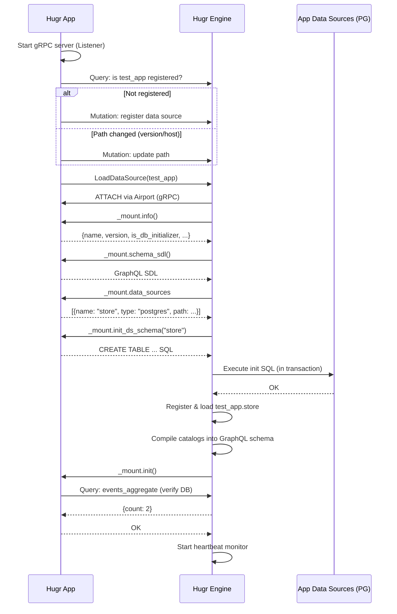
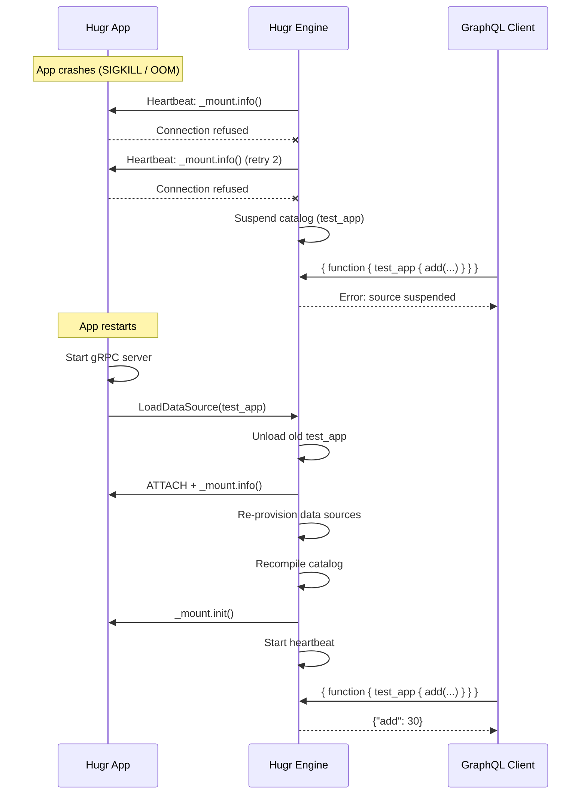
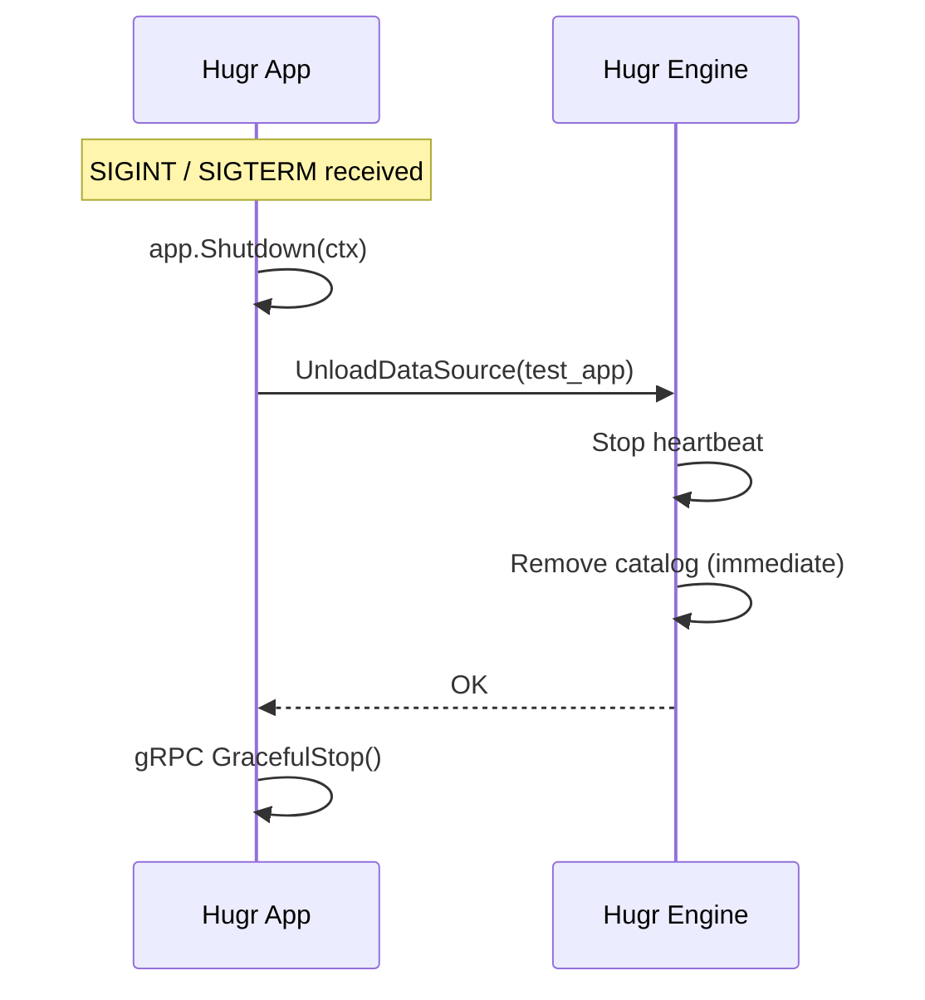

# Lifecycle & Monitoring

Hugr monitors connected apps via periodic heartbeat checks and handles crash recovery, graceful shutdown, and version upgrades automatically.

## Startup Flow



## Heartbeat Monitoring

After successful attachment, hugr starts a heartbeat monitor that periodically calls `_mount.info()` via DuckDB Airport.

| Setting | Env Var | Default |
|---------|---------|---------|
| Check interval | `HUGR_APP_HEARTBEAT_INTERVAL` | `30s` |
| Check timeout | `HUGR_APP_HEARTBEAT_TIMEOUT` | `10s` |
| Max failures before suspend | `HUGR_APP_HEARTBEAT_RETRIES` | `3` |

### Suspend

After `MaxRetries` consecutive failures, hugr **suspends** the app's catalog:
- GraphQL queries to app functions/tables return errors
- The app's data sources (e.g. PostgreSQL) remain accessible independently
- Hugr continues heartbeat checks

### Auto-Recovery

When a suspended app responds to heartbeat:
1. Hugr reads fresh `_mount.info()`
2. Recompiles the catalog (if SDL changed)
3. Re-provisions data sources
4. Reactivates the catalog in the GraphQL schema

## Crash & Recovery Sequence



## Graceful Shutdown



The app is cleanly removed from the GraphQL schema. Clients see the app's types disappear immediately.

## Crash Recovery

If the app crashes (SIGKILL, OOM, etc.):

1. `Shutdown()` is NOT called — no clean unload
2. Heartbeat detects failure after `interval × retries` (~90s with defaults)
3. Hugr suspends the catalog
4. When app restarts, it calls `LoadDataSource` → hugr reattaches
5. Catalog is recompiled and reactivated

## Hugr Restart

When hugr restarts while the app is running:

1. Hugr loads data source records from CoreDB
2. For `hugr-app` type: pre-checks TCP reachability before DuckDB ATTACH
3. If app is reachable → attaches, provisions, compiles catalog
4. If app is not reachable → skips (app will call `LoadDataSource` when it starts)

## Version Upgrade (Rolling Update)

When a new version of the app starts:

1. App registers with hugr (path includes `version=2.0.0`)
2. Hugr detects path change → updates CoreDB
3. `LoadDataSource` triggers full reload:
   - Re-reads `_mount.info()` (new version)
   - Re-provisions: checks `_hugr_app_meta` version → runs migration
   - Re-compiles catalog (if SDL changed; skips if hash matches)
4. Calls `_mount.init()` → app verifies DB state

```
App v1 (version=1.0.0) running
  ↓ stop
App v2 (version=2.0.0) starts
  → hugr detects version change in path
  → runs MigrateDBSchemaTemplate("store", "1.0.0")
  → recompiles catalog (only if SDL hash changed)
  → calls _mount.init()
```

## Lifecycle Summary

| Scenario | Detection | Recovery Time | Data Loss |
|----------|-----------|--------------|-----------|
| Graceful shutdown | Immediate (UnloadDataSource) | N/A | None |
| App crash | Heartbeat (~90s) | Instant on restart | None (DB persists) |
| Hugr restart | Startup load | App calls LoadDataSource | None (CoreDB persists) |
| Version upgrade | Path change | Instant | None (migration) |
