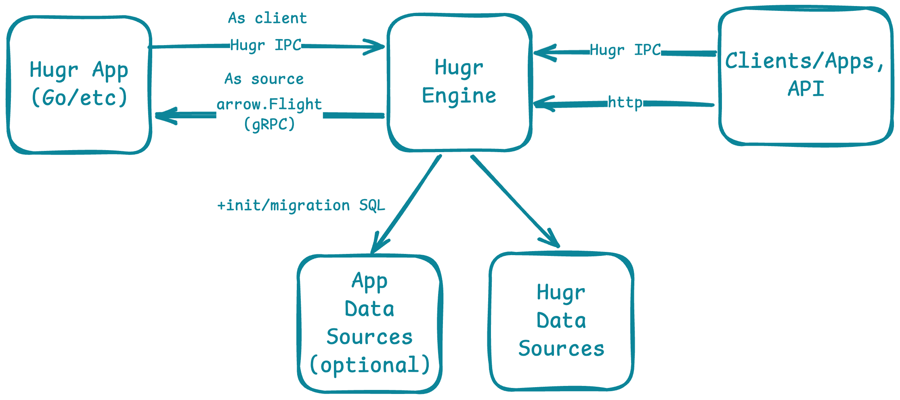

# Hugr Apps

Hugr Apps are pluggable applications that connect to the hugr engine via **DuckDB Airport extension** (Arrow Flight gRPC) and publish their API into the shared GraphQL schema.

## What Can a Hugr App Do?

- **Expose scalar functions** — add custom computations callable from GraphQL
- **Expose tables and table functions** — serve data from any source as queryable tables
- **Use hugr-managed databases** — declare PostgreSQL data sources with automatic schema init and migrations
- **Organize with modules** — group functions and tables into nested GraphQL modules
- **Hot-reload on update** — deploy new versions without downtime; hugr detects changes automatically

## Architecture

The app registers with hugr on startup. Hugr attaches the app via DuckDB Airport extension, reads the catalog (functions, tables) through `_mount` schema, and compiles them into the GraphQL schema. If the app declares data sources, **hugr** provisions the databases (connects to PostgreSQL, runs init/migrate SQL provided by the app) and mounts them as sub-modules.

## Sections

| Guide | Description |
|-------|-------------|
| [Getting Started](./1-getting-started.md) | Create your first hugr app in 10 minutes |
| [Application Interfaces](./2-interfaces.md) | `Application`, `DataSourceUser`, `DBInitializer`, `Shutdown` |
| [CatalogMux API](./3-catalog-mux.md) | Register functions, tables, table functions with `CatalogMux` |
| [Data Sources](./4-data-sources.md) | Declare PostgreSQL databases, schema init, migrations |
| [Schema Design](./5-schema-design.md) | Default schema, named schemas, modules, naming conventions |
| [Lifecycle & Monitoring](./6-lifecycle.md) | Heartbeat, crash recovery, graceful shutdown, rolling updates |
| [Configuration](./7-configuration.md) | Environment variables, `AppInfo` fields, reserved names |
